  <!-- Typing SVG by Ababyprogrammer -->
  

<h1 align="center">Hi 👋, I'm A baby programmer</h1>
<h3 align="center">I am a Iranian teenager.</h3>

  

- I'm have a repository for Smart Contract. [Smart-Contract](https://github.com/ababyprogrammer/Smart-Contract)

- I leaned the CS50 in Harvard. **CS50-CS50x-CS50T-CS50AI-CS50P**

- I'm have a repository for C/C++/C# [C](https://github.com/ababyprogrammer/C)

- I'm have a repository for JavaScript/TypeScript/Java [Backend](https://github.com/ababyprogrammer/Backend)

- I know 20% of network security. [Security](https://github.com/ababyprogrammer/Security)

- I know how to write Smart Contract. I know it %15. **I love Space science.**

- You want to talk to me? You can send me a E-mail. **ababyprogrammer@gmail.com**

- Who am I? **I am a backend and front end programmer**

 

## <b> Skills</b>
 

<table align="center">
  <tr>
    <td align="center" width="96">
        
       C
    </td>
    <td align="center" width="96">
      
       Python
    </td>
    <td align="center" width="96">
        
       JavaScript
    </td>
    <td align="center" width="96">
        
       C++
    </td>
    <td align="center" width="96">
        
       React
    </td>
    <td align="center" width="96">
        
       Solidity
    </td>
    <td align="center" width="96">
        
       TypeScript
    </td>
    <td align="center" width="96">
        
       AWS
    </td>
    <td align="center" width="96">
        
       C#
    </td>
  </tr>
  <tr>
  <td align="center" width="96">
        
       Node.js
    <td align="center" width="96">
        
       Github
    </td>
    <td align="center" width="96"> 
        
       Git
    </td>
    <td align="center"  width="96">
        
       Docker
    </td>
    <td align="center"  width="96">
        
       HTML5
    </td>
    <td align="center" width="96">
        
       CSS
    </td>
    <td align="center"  width="96">
        
       Bootstrap
    </td>
    <td align="center" width="96">
        
       Sass
    </td>
    <td align="center" width="96">
        
       Go
    </td>
  </tr>
 <tr>
      <td align="center" width="96">
        
       Photoshop
    </td>
        <td align="center" width="96">
        
       Swift
      </td>
      </td>
    <td align="center" width="96">
        
       PHP
    </td>
            <td align="center" width="96">
        
       VSCode
    </td>
              <td align="center" width="96">
        
       Vue
    </td>
      <td align="center" width="96">
        
       MySQL
  <td align="center" width="96">
      
       SQLite
    </td>
              <td align="center" width="96">
        
       Java
    </td>
    <td align="center" width="96">
        
       PostgreSQL
    </td>
 </tr>
</table>
  

## <b> Github Stats </b>

 

 

<!-- activity graph heroku-app start -->

    

<!-- activity graph heroku-app end -->

 
